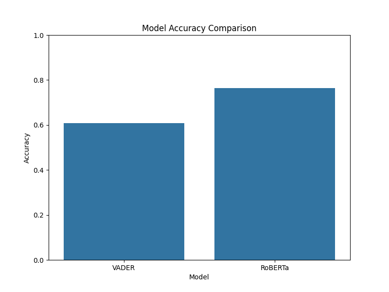
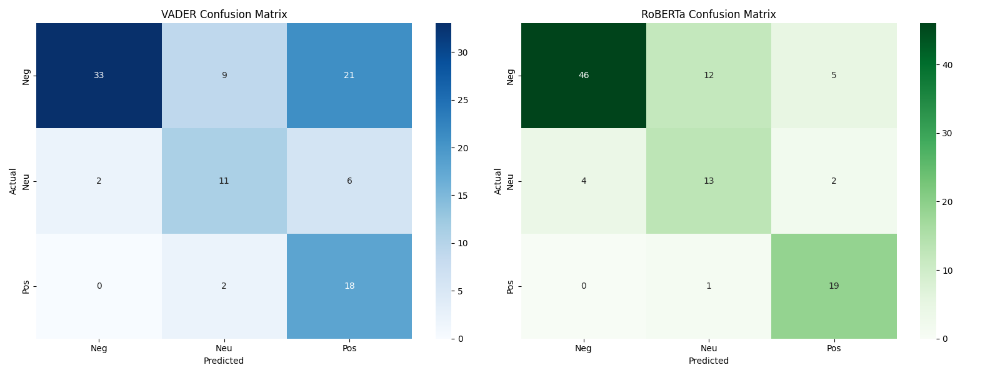
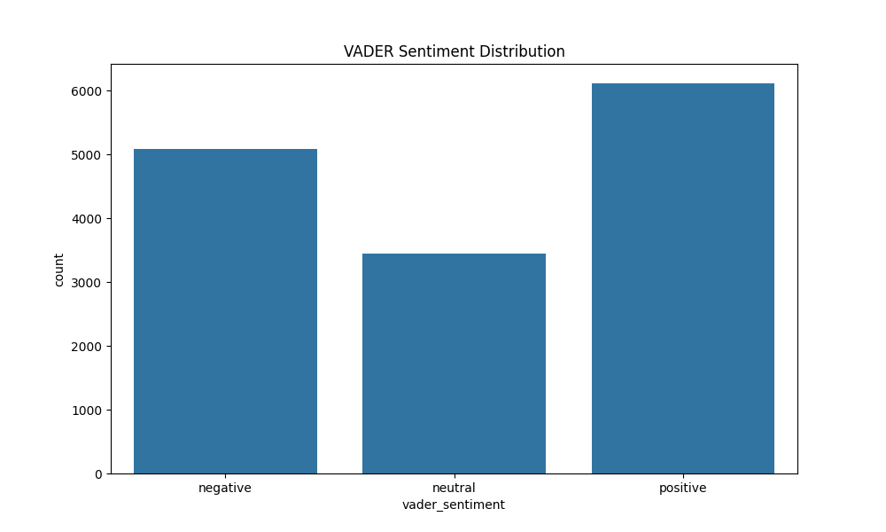
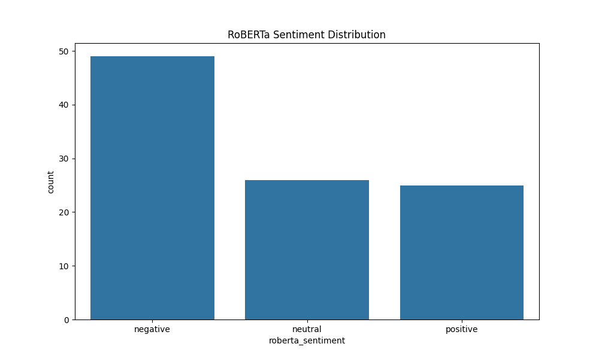

# Sentiment Analysis Comparison: VADER vs RoBERTa

This project compares two sentiment analysis approaches using the Twitter Airline Sentiment dataset:
1.  **VADER** (Valence Aware Dictionary and sEntiment Reasoner): A lexicon and rule-based sentiment analysis tool.
2.  **RoBERTa** (Robustly Optimized BERT Preapproach): A transformer-based model fine-tuned for twitter sentiment.

## 1. Performance Metrics

| Model | Accuracy | F1 (Weighted) |
| :--- | :--- | :--- |
| **VADER** | 60.8% | 0.62 |
| **RoBERTa** | **76.5%** | **0.77** |

RoBERTa significantly outperforms VADER, largely due to its ability to understand context (sarcasm, complex sentence structures) that VADER's lexicon-based approach misses.

## 2. Confusion Matrices

The confusion matrices show how often each model confused one sentiment for another.

-   **VADER**: Struggles with "Negative" tweets, often misclassifying them as "Positive" (likely due to recognized positive words in sarcastic warnings) or "Neutral".
-   **RoBERTa**: Much cleaner diagonal, indicating better classification across all categories.

## 3. Sentiment Distributions

### VADER Distribution

### RoBERTa Distribution

## 4. Example Disagreements (RoBERTa Correct, VADER Wrong)

Here are diverse examples where RoBERTa correctly classified the sentiment while VADER failed.

| Text | Ground Truth | VADER Prediction | RoBERTa Prediction | Analysis |
| :--- | :--- | :--- | :--- | :--- |
| *@united Yes my flight was rebooked. I'm just losing trust in you if I want to get anywhere on time.* | **NEGATIVE** | Positive | Negative | VADER sees "trust", "want" as positive. RoBERTa gets the context of "losing trust". |
| *@JetBlue I'll pass along the advice. You guys rock!!* | **POSITIVE** | Neutral | Positive | VADER often misses slang like "you guys rock" unless specifically tuned, treating it as neutral statements. RoBERTa understands the strong praise. |
| *@JetBlue 266 at LGB in Sunny So Cal http://t.co/V015PK7DSi* | **NEUTRAL** | Positive | Neutral | VADER treats "Sunny" as a strong positive indicator. RoBERTa correctly identifies this as a factual statement about location/weather. |

## Conclusion
RoBERTa is superior for this task, achieving **~16% higher accuracy** on the test sample. VADER is faster but fails on:
1.  **Context**: "losing trust" (negator + positive word).
2.  **Slang/Idioms**: "You guys rock".
3.  **Ambiguous Keywords**: "Sunny" in a factual context.
